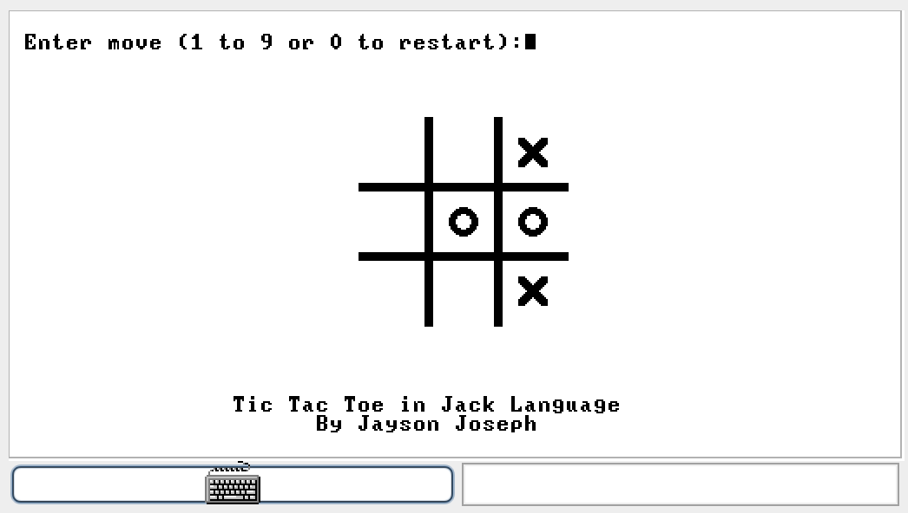

#Tic Tac Toe game in Jack Language
##About
This is a Tic Tac Toe game implementation in Jack language for the Hack platform. Please see [Nand2Tetris](http://nand2tetris.org/) project for more details.

This game uses Minmax algorithm for finding the computer move. Due to the exhaustive search, initial computer moves can take a while on slower computers. Note that computer cannot be beaten in the game. A good extension of this project will be to add difficulty levels such as easy and medium.

## Screenshot

## Demo
Check out the [Youtube video](https://www.youtube.com/watch?v=1picbaxgVfA) for a demo of this game running in Hack VM emulator.
